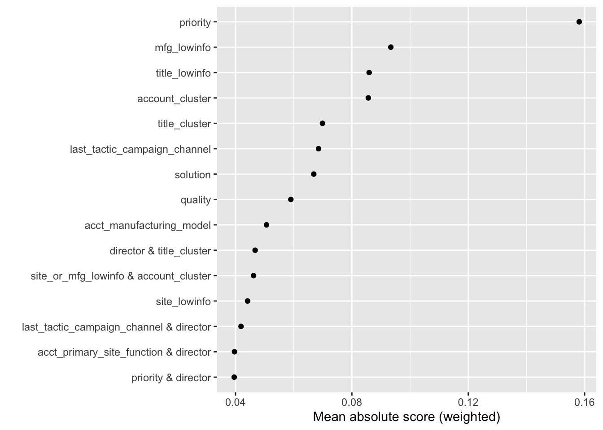
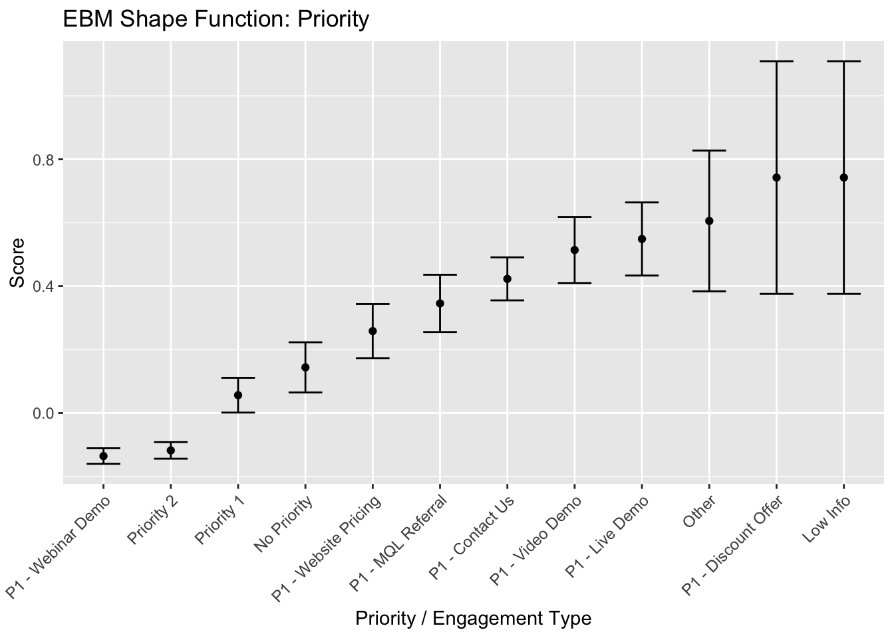
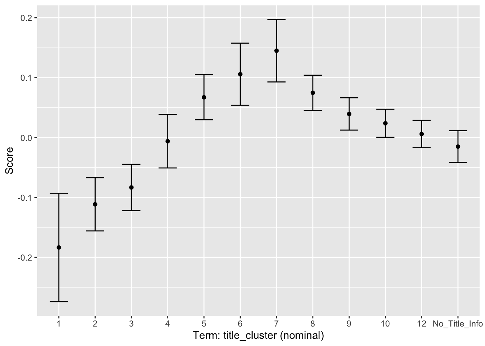

# MSBA Capstone — MasterControl MX Lead Progression

**Josh McAlister** · IS 6813 · Spring 2026 · University of Utah

This is my individual portfolio for a group capstone project completed with Corinn, Joel, and Gaby. The full group repository, including the shared EDA, baseline models, presentation slides, and team write-ups, lives at [**gabyr93/Group-Project-Master-Control**](https://github.com/gabyr93/Group-Project-Master-Control).

## Business Problem & Objective

MasterControl sells quality management (QX) and manufacturing execution (MX) software to life sciences companies. Their MX product, launched four years ago, converts qualified leads at **12.7%** — well below the 19.7% conversion rate of their mature QX product. Leadership asked us to find out why MX underperforms and identify what a higher-converting MX lead actually looks like.

The project analyzed **16,644 qualified-account-lead records** spanning January 2024 through December 2025. Our goal was to help the Sales and Marketing teams focus resources on the leads most likely to progress to SQL, SQO, or Won — and, just as importantly, to give sales reps an interpretable score they could reason about when deciding who to call.

## The Team's Solution

We approached the problem in three phases:

1. **Exploratory data analysis and feature engineering.** We cleaned the raw pipeline data, standardized missing and placeholder values into an explicit `Low Info` level, and engineered indicators for missing enrichment (`mfg_lowinfo`, `title_lowinfo`, `site_lowinfo`).

2. **Unsupervised clustering.** We ran four cluster analyses — account profile, job title role, an MX-specific lead-profile segmentation, and an ICP-discovery comparison — to surface structure that wasn't visible in any single variable. The resulting cluster labels became engineered features for the final model.

3. **Supervised modeling.** We built and compared six classifiers: baseline logistic regression, logistic regression with interaction terms, a decision tree, random forest, XGBoost, and an Explainable Boosting Machine. The EBM won with **0.87 ROC AUC** while remaining fully interpretable.

The final model produces a shape function for every feature, so a sales rep can see exactly why a given lead scored high or low. That transparency is what lets the model support routing decisions — e.g., QA Directors (cluster with the lowest MX score) should be rerouted to the QX product rather than discarded.

## Selected Visualizations

> **Explore the model interactively:** Open [`dashboard.html`](./dashboard.html) in a browser to see feature importance, shape functions, and the threshold-vs-cost trade-off with live controls. The dashboard is a single self-contained HTML file with no dependencies.

### Feature Importance: What Actually Drives Conversion

The EBM ranks every feature by its mean absolute contribution to the predicted log-odds of success. `priority` (engagement type) is the dominant signal by a wide margin — roughly **2× the influence of the next feature**. The data-completeness flags I engineered (`mfg_lowinfo`, `title_lowinfo`) rank second and third, and the cluster-label features I created (`account_cluster`, `title_cluster`) round out the top five. Notably, industry, territory, and account tier do not appear in the top 15 — contradicting the intuition that firmographic segmentation is the right place to start.

### Priority Shape Function: How Engagement Moves the Score

This is the detailed view of the single strongest feature. Above zero pushes toward conversion; below zero pulls away. Two things matter:

1. **P1 - Webinar Demo and Priority 2 are the only categories clearly below zero** (~-0.10). Webinar attendees convert worse than average once their other attributes are controlled for — they're a broader, less-ready audience.
2. **Contact Us, Video Demo, and Live Demo sit around +0.35 to +0.55.** Two leads that both look "Priority 1" in the CRM can produce wildly different predictions depending on which high-intent action they took. No firmographic filter catches that gap.

Rightmost categories (Other, Discount Offer, Low Info) have wide confidence intervals from small sample sizes — the model is appropriately uncertain there.

### Title Cluster Shape Function: The Cross-Sell Insight

The `title_cluster` feature compresses 361 sparse title-word columns into 12 interpretable groups. The shape function reveals a striking business story:

- **Cluster 7** (founders, production managers, plant managers, engineering managers) sits at **+0.15** with tight confidence intervals. These are roles that feel manufacturing-quality pain directly — exactly who the MX product is built for.
- **Cluster 1** (QA Directors, Quality Specialists, Associate Directors of Quality) is at **-0.19** — the lowest-scoring group. They sound like a natural MX audience but consistently don't convert.

The recommendation isn't to discard Cluster 1 leads. They're a **natural fit for QX** (quality management software) — this model surfaces a cross-sell opportunity that the team's initial firmographic analysis missed.

## My Contribution

My individual work focused on the EBM model and the cluster analysis feeding into it.

- **Built the EBM section end-to-end.** I researched the `ebm` R package (Brandon Greenwell, *R Journal*), set up the Python/`reticulate` backend, and implemented a fully self-contained modeling section — fit, predictions, calibration diagnostics, and global/local explanations. The code is in [`ebm_model.Rmd`](./ebm_model.Rmd).
- **Engineered the cluster-label features** (`account_cluster`, `title_cluster`, `mx_cluster`) so the EBM could consume them as inputs. This included handling the NAs that low-info titles produced with an explicit `"No_Title_Info"` factor level so the model's shape-function plots could still visualize that group.
- **Designed the EBM integration so it didn't disturb the shared pipeline.** Introducing cluster features into the group's `step_dummy()` recipe would have broken the GLM and decision tree. I made the EBM fully self-contained but used the same `set.seed(123)` + `caret::createDataPartition()` call as the shared pipeline — guaranteeing identical train/test rows so AUC comparisons across all three models are apples-to-apples.
- **Authored the standalone cluster analysis writeup** ([`cluster_analysis_writeup.Rmd`](./cluster_analysis_writeup.Rmd)) — a self-contained report documenting all four cluster analyses with embedded plots.
- **Added metric consistency.** The group's tidymodels models report `roc_auc` via `yardstick`, while the EBM's calibration output reports the mathematically identical C-statistic via `rms::val.prob()`. I added an explicit `yardstick::roc_auc()` call so the reported metric is directly comparable across notebooks.
- **Built the EBM slide section for the final presentation** — the glass-box explanation, the priority shape function as the single most important feature, and the "Cluster 7 prioritize / Cluster 1 reroute" recommendation.
- **Built an interactive dashboard** ([`dashboard.html`](./dashboard.html)) that makes the model's outputs explorable without requiring R. It lets a viewer drill into feature importance, cycle through shape functions, and drag sliders to see how the threshold and outreach cost change expected net value per 1,000 leads.

## Business Value

The EBM delivers measurable value along two dimensions:

**Targeting efficiency.** At a 0.10 probability threshold, the model identifies approximately 105 conversions per 1,000 leads pursued. At an average MX contract value of $70,000, that represents roughly $7.3 million in expected lifetime revenue per 1,000 scored leads — and outreach costs are almost negligible in comparison even at a generous $1,000 per lead.

**Closing the QX gap.** Lifting the MX progression rate from 12.7% toward 16–18% would represent a ~50% improvement in MX conversion and meaningfully narrow the gap with QX. The model identifies exactly which lead profiles sit on that gradient.

**Interpretability as a deployment enabler.** Black-box models produce scores a sales rep has no reason to trust. The EBM decomposes every prediction into exact per-feature contributions, so a rep can see that a lead scored highly because the engagement was a Contact Us request (+0.40) and the title clustered as Production Manager (+0.15) — not because of a statistical artifact. That transparency is what makes the model usable day-to-day in a CRM scoring workflow.

## Difficulties Encountered

- **Pipeline contamination.** My cluster-label features introduced NAs that broke the shared `step_dummy()` recipe on first integration. The fix was to isolate the EBM into its own self-contained section while still reusing the group's train/test split — a useful lesson in designing features that compose cleanly with teammates' code.
- **Python/R interop.** The `ebm` package wraps Python's `interpret` library via `reticulate`. I had to configure a dedicated virtualenv and persist the fitted model using `py_save_object()` (a Python pickle) rather than `saveRDS`, since reticulate objects don't serialize cleanly to R's native format.
- **Random forest overfitting.** Cross-validation AUC of ~0.83 dropped meaningfully on the held-out test set. This forced us to think critically about whether ensemble methods were actually generalizing or just memorizing patterns in our training data, and ultimately favored the EBM for both performance and honesty.
- **Class imbalance.** A 12.7% conversion rate means raw accuracy is misleading — a model that predicts "Not Successful" for every lead still scores ~87%. We evaluated on ROC AUC, calibration slope, and Brier score instead.
- **High-cardinality text data.** The `contact_lead_title` field expanded into 361 sparse binary title-word columns. Clustering them into 12 groups compressed the dimensionality without discarding signal — the resulting `title_cluster` feature ranked in the top five in EBM feature importance.
- **Missingness as signal, not noise.** Our initial instinct was to impute or drop missing fields. But leads with missing enrichment converted at 0.88% versus 18.84% for fully enriched leads — a 21x difference. Missingness itself was among the model's strongest predictors.

## What I Learned

- **Glass-box models can be competitive with black-box models.** The EBM beat XGBoost on this dataset while remaining fully interpretable. Interpretability is not always a performance trade-off.
- **Calibration matters as much as AUC** for probability outputs. A model that ranks correctly but produces over-confident probabilities is useless for business thresholding decisions. The EBM's Brier score of 0.073 and calibration slope of 0.98 were as important to me as the AUC itself.
- **Team pipelines need firewalls.** Introducing a new model with different data requirements should never break teammates' work. Self-contained sections with clearly documented join logic are the right pattern — and reusing the same split seed keeps cross-model comparisons fair.
- **Missingness is information.** Treating missing values as a separate signal added meaningful predictive power and surfaced a business insight: incomplete enrichment is itself a disqualification signal for sales outreach.
- **Feature engineering from unsupervised methods can add real signal.** The cluster labels ranked in the top five EBM feature importances — they weren't noise, they were compressed structure.
- **The C-statistic and ROC AUC are the same number with different names.** Biostatistics packages (`rms`) use one convention; tidymodels uses the other. Reporting both clarified comparisons across models without any team member needing to look it up.

## Repository Contents

| File | Description |
|------|-------------|
| [`dashboard.html`](./dashboard.html) | Interactive dashboard — feature importance, shape function explorer, threshold/cost trade-off, model comparison. Self-contained; open in a browser. |
| [`ebm_model.Rmd`](./ebm_model.Rmd) | Standalone EBM modeling notebook — data prep, fit, predictions, calibration, global and local explanations |
| [`cluster_analysis_writeup.Rmd`](./cluster_analysis_writeup.Rmd) / `.html` | Standalone writeup of all four cluster analyses (account profile, title roles, MX-specific, ICP discovery) with embedded plots |
| [`images/`](./images/) | Static plot exports embedded in this README |

**Not in this repo:** raw project data, the shared EDA notebook, other team members' modeling work, and the final presentation slides. For those, see the group repository: [gabyr93/Group-Project-Master-Control](https://github.com/gabyr93/Group-Project-Master-Control).

## Tools

R (tidyverse, tidymodels, caret, cluster, rms, yardstick), Python (interpret library via reticulate), and the [`ebm`](https://cran.r-project.org/package=ebm) R package by Brandon Greenwell.
